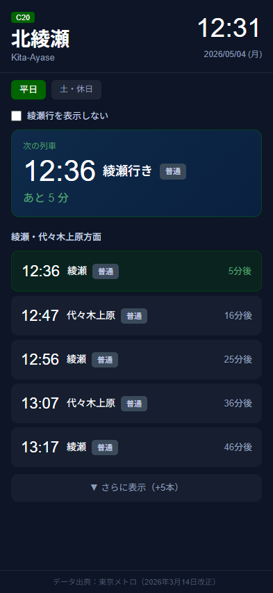

# 北綾瀬 時刻表 — 設計書

## 1. 概要

東京メトロ千代田線 北綾瀬駅（C20）の発車時刻表アプリ。  
スマートフォン（iPhone 15 Pro 相当）での利用を主眼に設計する。

- URL：https://kitaayase-timetable-fdvl.vercel.app/
- データソース：公共交通オープンデータセンター（ODPT API v4）
- フォールバック：ハードコードデータ（2026年3月14日改正）

---

## 2. 画面仕様

### 画面イメージ



### 画面構成

| 領域 | 内容 |
|------|------|
| ヘッダー | 路線記号・駅名・現在時刻・日付（曜日） |
| 曜日バッジ | 平日 / 土・休日 の切り替えタブ |
| フィルターバー | 行先別の表示/非表示トグル |
| 次の列車カード | 発車時刻・行先・種別・あと何分 |
| 列車リスト | 5本表示、+5本展開ボタン付き |
| 翌日接続 | 残り5本未満になると翌日の運行を続けて表示 |
| フッター | データ出典表記 |

---

## 3. 技術スタック

| 項目 | 採用技術 |
|------|---------|
| フレームワーク | React 19 + TypeScript |
| ビルドツール | Vite 8 |
| テスト | Vitest v4 + React Testing Library v16 |
| デプロイ | Vercel |
| データAPI | ODPT API v4（東京メトロ） |

---

## 4. データ取得フロー

```
アプリ起動
  ↓
sessionStorage キャッシュ確認
  ├─ HIT  → キャッシュデータを返す
  └─ MISS → ODPT API リクエスト
               ├─ 成功 → 平日・土休日データを両方キャッシュ
               └─ 失敗 → ハードコードデータにフォールバック
```

---

## 5. 深夜帯の切り替えロジック

| 状態 | 条件 | 表示 |
|------|------|------|
| 通常 | 残り5本以上 | 当日の列車のみ |
| 接続表示 | 残り5本未満（終電前） | 当日残り ＋ 翌日先頭5本 |
| 翌日切替 | 終電通過後（`upcomingTrains.length === 0`） | 翌日のみ |

- サービス日の定義：0〜4時台は前日のサービス日（例：日曜00:30 → 土曜ダイヤ）
- ヘッダーの「→ 翌」矢印：`isNextDay && hours >= 5` のときのみ表示
